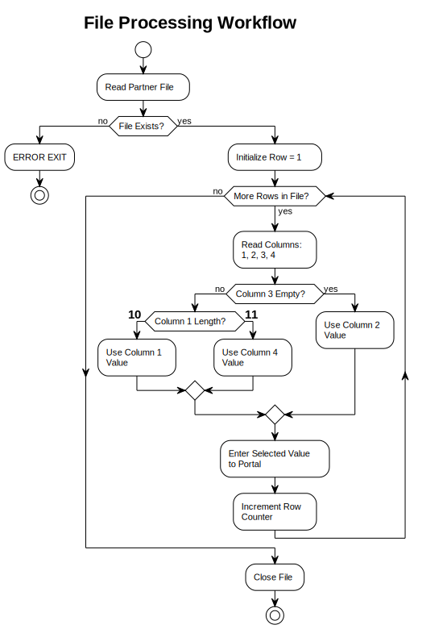

# Task 2: File Processing Diagram with Conditional Logic

Last updated: 2025-10-24T23:35:47+03:00

**Prepared for**: Elektrum Eesti OÜ - IT Projektijuht Position  
**Date**: October 23, 2025  
**Author**: Mihkel Putrinš

---

## 1. Business Context

Elektrum receives files from external partners containing customer data in multiple columns. The system must read these files, apply conditional logic to determine which column value to use, and enter the selected value into the portal system.

### Processing Rules

The file contains 4 columns per row:

- **Column 1**: Primary identifier (length can be 10 or 11 characters)
- **Column 2**: Secondary value (used when Column 3 is empty)
- **Column 3**: Optional field (may be empty)
- **Column 4**: Alternative value (used when Column 1 has 11 characters)

**Conditional Logic**:

1. **Priority 1 - Column 3 Check**:

   - IF Column 3 is empty -> Use Column 2 value only
   - IF Column 3 has data -> Continue to next check

2. **Priority 2 - Column 1 Length Check** (only if Column 3 has data):
   - IF Column 1 length = 10 characters -> Use Column 1 value
   - IF Column 1 length = 11 characters -> Use Column 4 value

## 2. Process Flowchart



**Process Flow**:

1. Read partner file -> Exit if file doesn't exist
2. Initialize row counter
3. Loop through rows: Read 4 columns per row
4. Apply conditional logic to select value
5. Enter selected value to portal
6. Continue until all rows processed

**Key Features Demonstrated**:

- Loop structure (iterate through all file rows)
- Conditional branches (Column 3 empty check, Column 1 length check)
- Clear decision logic with standard flowchart notation
- Error handling (file not found)

\newpage

## 3. Example Scenarios

**Scenario 1: Column 3 Empty**  

- Input:

  ```text
  "1234567890" (10), "VALUE_B", "" (empty), "VALUE_D"
  ```

- Logic: Column 3 empty? -> YES -> Use Column 2
- Result: "VALUE_B"

**Scenario 2: Column 3 Has Data, Length 10**  

- Input:

  ```text
  "ABCDEFGHIJ" (10), "VALUE_B", "VALUE_C", "VALUE_D"
  ```

- Logic: Column 3 empty? -> NO -> Length = 10? -> YES -> Use Column 1
- Result: "ABCDEFGHIJ"

**Scenario 3: Column 3 Has Data, Length 11**  

- Input:

  ```text
  "ABCDEFGHIJK" (11), "VALUE_B", "VALUE_C", "VALUE_D"
  ```

- Logic: Column 3 empty? -> NO -> Length = 10? -> NO (it's 11) -> Use Column 4
- Result: "VALUE_D"

**Scenario 4: Multiple Rows Processing**  

Input File:

```text
Row 1: "1234567890", "VAL_B1", "",        "VAL_D1"
Row 2: "ABCDEFGHIJ", "VAL_B2", "VAL_C2",  "VAL_D2"
Row 3: "ABCDEFGHIJK","VAL_B3", "VAL_C3",  "VAL_D3"
Row 4: "1234567890", "VAL_B4", "VAL_C4",  "VAL_D4"
```

Processing:

- Row 1: Column 3 empty -> Use "VAL_B1"
- Row 2: Column 3 has data, Length 10 -> Use "ABCDEFGHIJ"
- Row 3: Column 3 has data, Length 11 -> Use "VAL_D3"
- Row 4: Column 3 has data, Length 10 -> Use "1234567890"

Portal Entries: "VAL_B1", "ABCDEFGHIJ", "VAL_D3", "1234567890" (in order)

---

## 4. Error Handling

1. **File Not Found** -> Log error, notify administrator, exit gracefully
2. **Empty File** -> Log warning, exit (no data to process)
3. **Missing Columns** -> Log error with row number, skip row, continue processing
4. **Invalid Column 1 Length** (!=10 or !=11) -> Skip row, log issue
5. **Portal Entry Failure** -> Retry 3 times, then log error and continue (or halt per business requirements)

\newpage

## 5. Implementation Considerations

### Performance

- Stream file reading (row-by-row) for memory efficiency with large files
- Consider batch or parallel processing for millions of rows
- Add throttling if portal has API rate limits

### Monitoring & Logging

**Key Metrics**:

- Total rows processed
- Distribution: Column 2 used (Col 3 empty), Column 1 used (length 10), Column 4 used (length 11)
- Errors by type
- Processing time per row (avg, min, max)
- Portal API response time

**Logging**:

- Start/end timestamps for each file
- Errors with row numbers for troubleshooting
- Summary statistics after processing

### Validation

**Pre-processing**:

- File format check (CSV, TSV, fixed-width?)
- Column count validation
- Column 1 format validation (alphanumeric only?)

**Post-processing**:

- Verify row count matches expected
- Check error rate threshold (<5%)
- Confirm portal entries match processed rows

---

## 6. Deliverables

1. **task2_submission.md** (this document) - Complete process documentation with flowchart and examples
2. **task2_file_processing.puml** - PlantUML source code for diagram regeneration
3. **task2_file_processing_diagram.svg** (15 KB) - Visual flowchart (vector format)
4. **task2_file_processing_diagram.png** (38 KB) - Visual flowchart (raster format)

---

**Document ID**: TASK2  
**Document Version**: 1.0  
**Date**: October 23, 2025  
**Author**: Mihkel Putrinš
