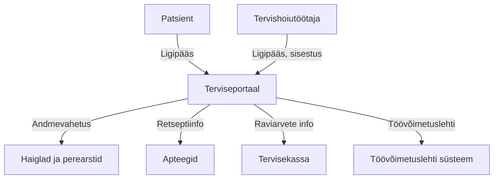

# Terviseportaal – Eesti riiklik patsiendiportaal

**Terviseportaal** (<www.terviseportaal.ee>) on Eesti riiklik digiteenus, mis võimaldab kodanikel, tervishoiutöötajatel ja ametiasutustel turvaliselt hallata ja vaadata terviseandmeid ühes kohas.

## Põhifunktsioonid ja võimalused

- **Patsiendi iseteenindus:** Ligipääs oma terviseandmetele (retseptid, epikriisid, uuringutulemused, vaktsineerimised, digilugu jne)
- **Tervishoiuteenuste broneerimine:** Aja broneerimine arstile, vaktsineerimisele, uuringutele
- **Terviseandmete jagamine:** Võimalus anda ligipääsu oma andmetele pereliikmetele või arstidele
- **Tervisealane suhtlus:** Turvaline suhtlus tervishoiutöötajatega, e-konsultatsioonid
- **Teavitused ja meeldetuletused:** Ravimite võtmise, visiitide ja vaktsineerimiste meeldetuletused
- **Terviseandmete parandamine:** Võimalus esitada parandustaotlusi oma andmete kohta

## Kasutajad

- Eesti elanikud (patsiendid)
- Tervishoiutöötajad (arstid, õed, apteekrid)
- Riiklikud ja ametlikud asutused

## Eesmärk ja roll tervishoiusüsteemis

- **Keskne andmevahetusplatvorm:** Koondab ja vahendab terviseandmeid erinevate infosüsteemide vahel
- **Patsiendikesksus:** Võimaldab patsiendil olla oma terviseandmete peremees ja osaleda aktiivselt raviprotsessis
- **Tervishoiuteenuste kättesaadavus:** Lihtsustab ja kiirendab suhtlust ning teenuste kasutamist

## Turvalisus ja privaatsus

- **Autentimine:** Sisselogimine ID-kaardi, Mobiil-ID, Smart-ID või EU eID kaudu
- **Andmekaitse:** Vastavus GDPR-ile ja Eesti andmekaitseseadustele
- **Ligipääsukontroll:** Kasutaja saab ise hallata, kes tema andmeid näevad

## Andmevahetus ja tehniline pool

- **Tervishoiuasutuste andmevahetus:** Terviseportaal vahendab tervishoiuasutuste (haiglad, perearstid) koostatud meditsiinidokumente, saatekirju, epikriise, uuringutulemusi.  
  [Allikas: TEHIK – Terviseportaal](https://www.tehik.ee/terviseportaal)
- **Retseptide süsteem:** Retseptide info on Terviseportaalis kättesaadav patsientidele ja arstidele.  
  [Allikas: TEHIK – Terviseportaal](https://www.tehik.ee/terviseportaal)
- **Haigekassa (Tervisekassa):** Patsiendid saavad vaadata raviarveid, mille eest Tervisekassa on raviasutustele tasunud.  
  [Allikas: TEHIK – Terviseportaal](https://www.tehik.ee/terviseportaal)
- **Töövõimetuslehti süsteem:** Töövõimetuslehti saab vaadata Terviseportaalis.  
  [Allikas: TEHIK – Terviseportaal](https://www.tehik.ee/terviseportaal)

### Visuaalne skeem: Terviseportaali liidestused

#### Allikad

- [TEHIK – Terviseportaal](https://www.tehik.ee/terviseportaal)
- [Terviseportaal](https://www.terviseportaal.ee/)

## Kokkuvõte

Terviseportaal on Eesti digitaalse tervishoiu keskne tööriist, mis võimaldab turvalist, mugavat ja patsiendikeskset ligipääsu terviseandmetele ning toetab kogu tervishoiusüsteemi efektiivsust ja läbipaistvust.

_Allikas: [terviseportaal.ee](https://www.terviseportaal.ee/)_
