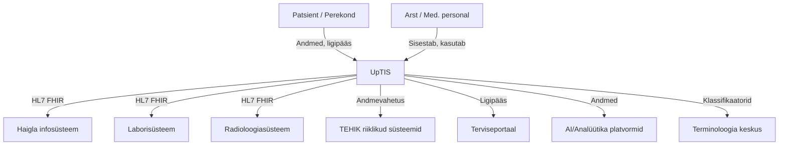

# UpTIS – Uue põlvkonna tervise infosüsteem

**UpTIS** (Uue põlvkonna Tervise Infosüsteem) on Eesti riigi uus keskne terviseandmete platvorm, mida arendab TEHIK. UpTIS-i eesmärk on muuta terviseandmete haldus, vahetus ja kasutamine turvalisemaks, paindlikumaks ja kasutajasõbralikumaks nii patsientidele, tervishoiutöötajatele kui ka riigile.

## Projekti praegune staatus (2025)

- **Etapp:** Sisulise planeerimise ja tehnilise uuendamise faas
- **Eesmärk:** Tervise infosüsteemi arenguhüpe ja kvalitatiivne tasemehüpe
- **Põhimõte:** Dokumendipõhiselt süsteemilt reaalajas andmevahetusele üleminek

## Olulised märksõnad

- **Andmete ühtne vaade:** Kõik patsiendi terviseandmed on koondatud ühtu kohta, võimaldades paremat ülevaadet ja kiiremat otsustamist.
- **Reaalajas andmevahetus:** Süsteem toetab reaalajas andmevahetust erinevate tervishoiuasutuste ja riiklike infosüsteemide vahel.
- **Moodulipõhine arhitektuur:** UpTIS on üles ehitatud moodulitena, mis võimaldab paindlikku arendust ja lihtsat liidestamist teiste süsteemidega.
- **HL7 FHIR standard:** Uus andmevahetus baseerub HL7 FHIR standardil, mis võimaldab väiksemaid, paindlikumaid teenuseid
- **Turvalisus ja privaatsus:** Rõhk on andmete turvalisel töötlemisel ja GDPR-i nõuete järgimisel.
- **Kasutajakesksus:** Lihtsamad töövood arstidele ja patsiendisõbralikumad digiteenused.
- **Andmete ühekordne küsimine:** Minimeeritakse dubleerivate ja tervisega mitteseonduvate andmete kogumist

## Tehnilised põhimõtted

### HL7 FHIR andmevahetusstandard

- **Reaalajas andmevahetus:** Dokumendipõhiselt süsteemilt reaalajas andmevahetusele
- **Väiksemad andmegrupid:** Suurte andmevahetusstandardite asemel väiksemad, paindlikumad teenused
- **Euroopa ühilduvus:** Toetab piiriülest andmevahetust EL-is
- **Lihtne juurutamine:** Hea dokumentatsioon ja testimisvõimalused

### Klassifikaatorid ja terminoloogia

- Klassifikaatorite ja terminoloogia haldamise süsteemi loomine
- Kaasaegne teabekeskus senise publitseerimiskeskuse asemele
- Põhjalikum TIS andmekoosseisu avaldamine

## Põhieesmärgid

### Tervishoiutöötajatele

- Rollipõhine andmete ligipääs
- Dokumenteerimispõhimõtete uuendamine tööprotsesside toetamiseks
- Rohkem aega ravitööle ja inimlikule kontaktile
- Mugav, turvaline ja efektiivne andmete kasutamine

### Patsientidele

- Lihtne, kiire ja arusaadav ülevaade terviseloost
- Otsuste tegemist toetav informatsioon
- Personaalsed teenused

### Süsteemiarendajatele

- Lihtsam tervishoiu tarkvarasüsteemide arendamine
- Selged ja arusaadavad standardite juurutusjuhendid
- Paindlikum õigusruum uute tehnoloogiate kiiremaks kasutuselevõtuks

## Visuaalne skeem: UpTIS roll tervise infosüsteemide ökosüsteemis

## Koostööpartnerid

- **Sotsiaalministeerium**
- **Tervisekassa**
- **Kõik tervisesüsteemi huvipoolte esindajad** (kliiniline, poliitikakujunduse ja tehniline vaade)

*Allikas: [TEHIK – UpTIS](https://www.tehik.ee/uue-polvkonna-tervise-infosusteem-uptis)*
