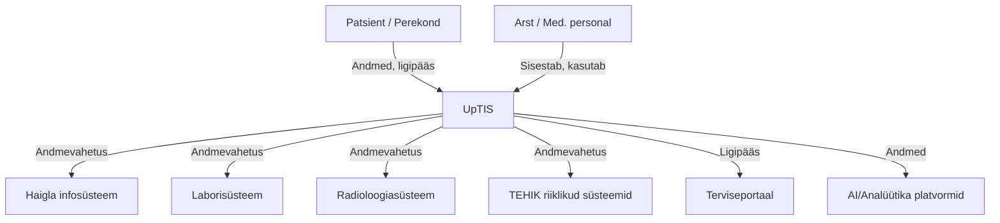

# UpTIS – Uue põlvkonna tervise infosüsteem

**UpTIS** (Uue põlvkonna Tervise Infosüsteem) on Eesti riigi uus keskne terviseandmete platvorm, mida arendab TEHIK. UpTIS-i eesmärk on muuta terviseandmete haldus, vahetus ja kasutamine turvalisemaks, paindlikumaks ja kasutajasõbralikumaks nii patsientidele, tervishoiutöötajatele kui ka riigile.

## Olulised märksõnad
- **Andmete ühtne vaade:** Kõik patsiendi terviseandmed on koondatud ühte kohta, võimaldades paremat ülevaadet ja kiiremat otsustamist.
- **Reaalajas andmevahetus:** Süsteem toetab reaalajas andmevahetust erinevate tervishoiuasutuste ja riiklike infosüsteemide vahel.
- **Moodulipõhine arhitektuur:** UpTIS on üles ehitatud moodulitena, mis võimaldab paindlikku arendust ja lihtsat liidestamist teiste süsteemidega.
- **Turvalisus ja privaatsus:** Rõhk on andmete turvalisel töötlemisel ja GDPR-i nõuete järgimisel.
- **Kasutajakesksus:** Lihtsamad töövood arstidele ja patsiendisõbralikumad digiteenused.

## Visuaalne skeem: UpTIS roll tervise infosüsteemide ökosüsteemis

*Allikas: [TEHIK – UpTIS](https://www.tehik.ee/uue-polvkonna-tervise-infosusteem-uptis)*
